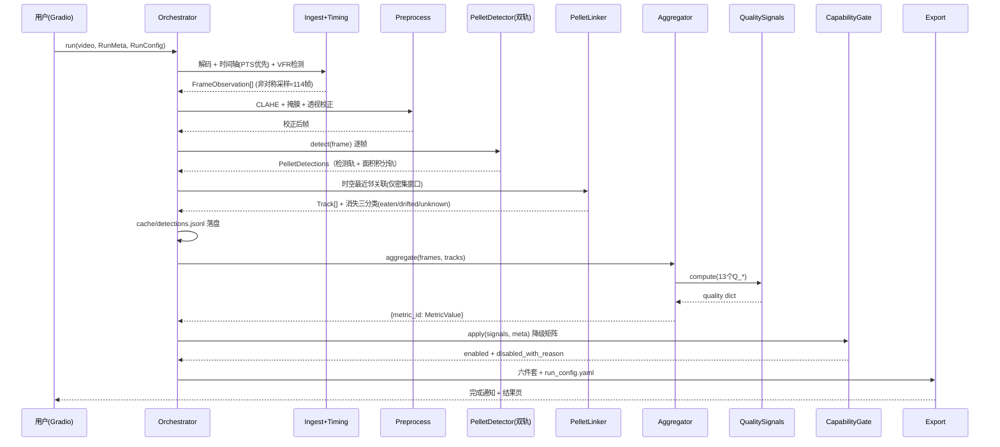
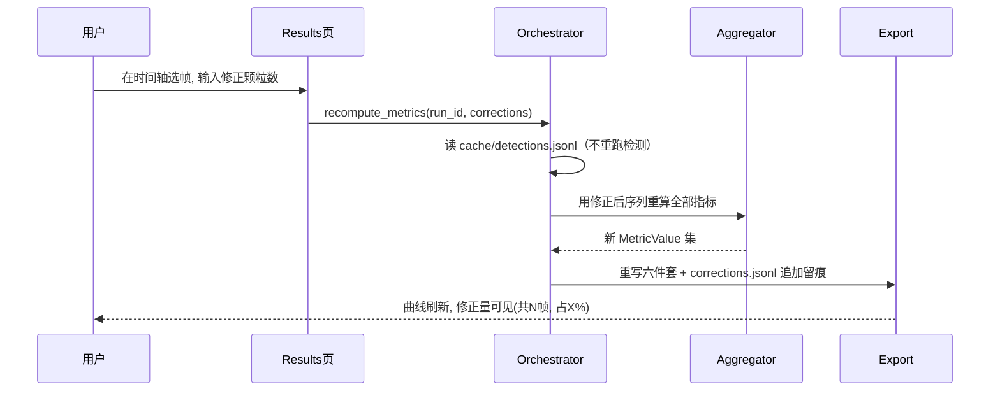
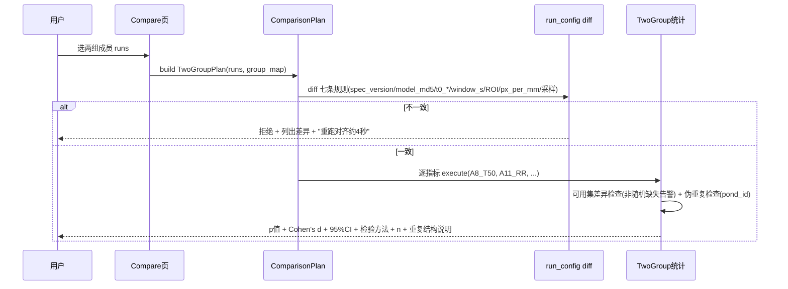
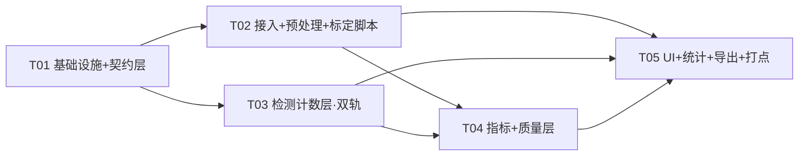

# 06 · 系统架构设计与实现任务分解

| 项目 | 内容 |
|---|---|
| 文档编号 | 06 |
| 版本 | v1.0 |
| 作者 | 高见远（架构师） |
| 日期 | 2026-08-30 |
| 输入 | `docs/02`（技术调研 v14）、`docs/03`（PRD v1.0）、`docs/04`（指标输入契约 v9）、用户两轮决策 |
| 消费方 | 工程师寇豆码（本文档自包含：关键约定已内联，**不读 docs/02 也能开工**）、PM（评审指标与验收标准） |

---

## 0. 设计输入（用户两轮决策，已吸收进本设计）

| 决策 | 架构影响 |
|---|---|
| **第一轮**：浮性膨化料 / 户外池塘网箱 / 愿标注 20–50 帧 / 科研进论文 | 户外适配方案（docs/02 §8）全部落地：透视标定 P0、面积积分双轨计数、空间异质性活跃度、点标注、B2/C 组默认降级 |
| **第二轮 ①**：实验设计以**两组对照**为主（剂量梯度暂不做） | 统计层实现两组特例，但**必须抽象为「比较计划 ComparisonPlan」**（P0-FR-29），剂量梯度留扩展位，不实现 |
| **第二轮 ②**：**投喂框 + 尺寸参照物都可以布设** | 浮动投喂框为**主标定物**（四角即单应性四点 + pellet_zone 边界，P0-FR-38）；尺寸参照物为备份路径（框缺失时）。两条标定路径都进 UI |
| **第二轮 ③**：**三脚架固定、岸边斜拍** | 斜拍为确定机位 → 透视校正（`findHomography`）是 P0 硬需求；**必须向用户声明能力边界：单应性只修尺度、不修遮挡** |
| **第二轮 ④**：**打点计数辅助工具从 P1 提到 P0** | 新增 `src/app/pages/tally.py` 回放打点工具：人工看回放击键计数 → `manual_counts.csv` → 作为真值对照输入（G1 的误差实测来源）+ 独立证据链 |

**一句话架构**：户外斜拍场景下，重心从"看懂鱼"移到"数清颗粒"——主结论建立在 A 组颗粒曲线上，鱼体相关指标（B2/C）默认降级为探索性输出，打点计数工具提供人工真值锚点。

---

# Part A · 系统设计

## 1. 实现概述

### 1.1 核心技术挑战（按风险排序）

| # | 挑战 | 对策（本设计的落点） |
|---|---|---|
| 1 | **COCO 没有 fish 类，零训练跑不了**（最大认知陷阱） | 冷启动分层：L0 无标注（面积积分 + YOLOE 开放词汇辅助）→ L1 点标注微调（20–50 帧，40–80 分钟） |
| 2 | **户外波浪/反光/光照漂移**：全画面帧差指标信噪比 <1 | 参考区逐帧扣除（α 由基线回归）+ 空间异质性指标（网格峰度/基尼，对全局波浪不敏感）+ 掩膜排除区 |
| 3 | **N₀ 系统性低估**（密集粘连漏检） | 双轨计数：检测计数（稀疏段）+ 面积积分 `N_area = A_fg / A_single(t)`（密集段），两条曲线交叉校验 |
| 4 | **漂出 vs 吃掉不可分** | 浮框边界穿越判定 + 消失三分类 `n_eaten / n_drifted / n_unknown`，unknown 严禁猜测 |
| 5 | **"算对了但意思错了"**（本项目四轮交叉核验抓到的模式） | `MetricValue` 构造期强制（写错了构造不出来）+ 13 个 Q_* 必算必输出 + 降级矩阵 + 阻断 flag 体系 |
| 6 | **伪重复**（同一池塘多次投喂 ≠ n 次独立样本） | 重复结构强制声明 + 默认 MixedLM 随机效应；单池塘 → 报告标注"仅描述性" |
| 7 | **斜拍尺度不一致** | 4 点单应性 + 尺度场（`px_per_mm(x,y)` 随位置变化，点标注生成框时按位置取半径） |

### 1.2 技术栈（v14 冻结版，逐条有核实依据，见 docs/02）

- **语言/运行时**：Python 3.11（锁定 `C:\Program Files\Python311`，本机已装）
- **检测**：Ultralytics YOLO11m（`imgsz=1280`，小目标必需）+ SAHI 切片推理（必开）
- **跟踪/关联**：Ultralytics 内置 BoT-SORT/ByteTrack（鱼，探索性）；颗粒用自研时空最近邻关联（不用匈牙利）
- **传统 CV**：OpenCV（`findHomography` 透视校正、CLAHE、掩膜、网格帧差、Farneback 光流）
- **UI**：Gradio（本机 Web，视频预览/进度条/打点）
- **统计**：pingouin（主）+ statsmodels（MixedLM/多重比较）+ scipy.stats
- **图表**：matplotlib
- **标注**：Label Studio（独立环境 `requirements-labeling.txt`，点标注）

### 1.3 架构模式与总体形态

**分层管道 + 缓存锚点（pipeline + run repository）**：

```
视频文件 + RunMeta + run_config.yaml
   │
   ▼
[1] ingest      解码、时间轴构建（逐帧 PTS 优先）、非对称采样
[2] preprocess  透视校正、CLAHE、ROI/排除区掩膜
[3] detect      双轨：YOLO+SAHI 检测计数 ‖ 面积积分计数（共用 A_single(t)）
[4] link        颗粒时空最近邻关联 + 消失三分类（eaten/drifted/unknown）
[5] metrics     A 组曲线（主）+ B1 空间异质性 + B2/B3 探索性 → MetricValue
[6] quality     13 个 Q_* + capability 降级矩阵（产出 disabled_with_reason）
[7] export      六件套输出 + run_config 留档（可复现锚点）
   │
   ▼
runs/<run_id>/cache/  ← 人工修正只重跑 [5][6][7]（秒级，不重跑检测）
   │
   ▼
[8] compare     跨 run：run_config diff 七条拒绝规则 → 两组统计（ComparisonPlan）
```

**关键架构决策**（每条对应 docs/02/03/04 的编号需求）：

1. **`metrics/` 层完全独立于检测实现**：指标只消费 `FrameObservation` 契约（docs/04 §1），检测器可插拔（`detectors/base.py` 统一接口），换模型不动指标。
2. **`MetricValue` 是全局约束点**：所有"不得用 0 冒充 / reason 必填 / 量纲依赖链"禁令收敛到构造期校验，**写错了构造不出来**。
3. **缓存分层使人工修正零成本**：检测/跟踪结果落盘 `cache/detections.jsonl`，修正时序数据后仅重跑 metrics 层。
4. **`capability.py` 降级不关闭**：只有实测 Q_* 信号和用户元数据有权关闭指标；自动推断的分类只追加 ⚠️ 降级。
5. **`run_config.yaml` 是可复现与可比性的锚点**：跨 run 比较前必须 diff，七条规则不一致即拒绝（附"重跑对齐约 4 秒"提示）。
6. **打点计数（P0 新增）作为独立证据链**：`manual_counts.csv` 与自动曲线**并列展示、永不合并**，用于误差实测（G1）与审稿答辩。

---

## 2. 文件清单（P0 范围，38 个源文件 + 测试）

> 训练脚本（`01_download_public_datasets.py`、`02_pretrain_fish.py`、`03_finetune.py` 等）**不在 P0 任务内**，仅在文件清单中预留位置。P0 用 YOLOE 开放词汇 + 面积积分冷启动即可出 A 组曲线；L1 微调作为交付后增强。

```
鱼类摄食行为视频识别/
├── requirements.txt                     # 主环境依赖（含 CUDA index-url 注释）
├── requirements-labeling.txt            # Label Studio 独立环境
├── configs/
│   ├── default.yaml                     # 26 个阈值 + 采样参数 + 13 Q_* 门限（docs/04 §5）
│   └── calibration/                     # scripts/00 输出的 A_single(t) / v_sink_max 等
│
├── src/
│   ├── core/                            # ★ 契约层（T01，最先写、最严测试）
│   │   ├── config.py                    # RunConfig dataclass + YAML I/O + 模型指纹
│   │   ├── metric_value.py              # ★ MetricValue（构造期强制，见 §3）
│   │   ├── frame_context.py             # FrameObservation / Detections / RunMeta / BaselineStats
│   │   ├── roi.py                       # ROI 多边形（投喂区/参考区/排除区）+ 点在多边形内判定
│   │   └── homography.py                # HomographyCalibrator：4 点标定 + 尺度场 px_per_mm(x,y)
│   │
│   ├── pipeline/                        # ★ 处理管线（T02/T03）
│   │   ├── timing.py                    # 时间轴构建（PTS 优先）+ VFR/拼接/慢动作检测
│   │   ├── ingest.py                    # 解码 + 非对称采样（基线2s/早期1s/尾段10s ≈114帧）
│   │   ├── preprocess.py                # CLAHE + 掩膜 + warpPerspective（可选整幅校正）
│   │   ├── meta_validation.py           # RunMeta 交叉校验（n_fish_total 单向告警等 8 项）
│   │   ├── detectors/
│   │   │   ├── base.py                  # PelletDetector 抽象接口
│   │   │   ├── yolo_detector.py         # Ultralytics + SAHI 封装（L1 微调后的主通道）
│   │   │   ├── yoloe_detector.py        # 开放词汇冷启动（L0，无需训练）
│   │   │   └── area_integral.py         # ★ 面积积分计数：N_area = A_fg / A_single(t)
│   │   ├── pellet_linker.py             # 时空最近邻 + 边界穿越 + 消失三分类 + 短暂消失容忍
│   │   └── orchestrator.py              # 串管线 + 进度回调 + 缓存读写 + 中断续跑
│   │
│   ├── metrics/                         # ★ 指标层（T04，业务核心）
│   │   ├── group_a/
│   │   │   ├── n0_estimator.py          # A1 N₀ 双轨（N0_det vs N0_meta，偏差>20% 告警）
│   │   │   ├── pellet_curve.py          # A2–A4 N_p(t) 双轨曲线 + C(t) + P(t)
│   │   │   ├── clearance.py             # A8–A10 T50/T90/T100（右删失→None+window_s）
│   │   │   ├── rate.py                  # A5–A7 v(t)/v_max/v̄₅₀（峰值限定早期窗）
│   │   │   ├── residual.py              # A11 RR + A12 指数拟合（R²<0.6 不输出）+ A13 AUC
│   │   │   └── nonfeeding_loss.py       # A14 漂出/unknown 损失（仅密集窗口 a14_window_s）
│   │   ├── group_b1/
│   │   │   ├── spatial_heterogeneity.py # ★ 网格16×16帧差 → 峰度/基尼/前5%能量占比
│   │   │   └── reference_correction.py  # 参考区扣除 α（基线期回归，禁止拍脑袋）
│   │   ├── group_b2/
│   │   │   └── zone_metrics.py          # 投喂区热力占比（探索性，户外默认降级）
│   │   ├── quality.py                   # ★ 13 个 Q_* 必算必输出（含 Q_glare/Q_interf）
│   │   ├── capability.py                # 降级矩阵（docs/04 §4.2）+ disabled_with_reason
│   │   └── aggregator.py                # 汇总 summary（严禁 B1/B2 合成单一标量）
│   │
│   ├── stats/                           # ★ 统计层（T05）
│   │   ├── comparison_plan.py           # ComparisonPlan 抽象（两组=特例，剂量梯度留位）
│   │   └── two_group.py                 # 正态性/方差齐性 → t/MW + Cohen's d + CI + MixedLM + 伪重复
│   │
│   ├── export/                          # ★ 输出层（T05）
│   │   ├── csv_writer.py                # metrics_summary.csv（17列冻结）+ timeseries（原生时间戳+dt_s）
│   │   ├── summary_writer.py            # summary.json + capability_report.md + flag_glossary
│   │   ├── charts.py                    # matplotlib（删失段特殊渲染，插值线叠真实采样点）
│   │   └── compare.py                   # ★ run_config diff 七条拒绝规则 + 分组对比视图数据
│   │
│   ├── app/                             # ★ Gradio UI（T05）
│   │   ├── main.py                      # 入口，多页签组装 + 盲法开关
│   │   └── pages/
│   │       ├── project.py               # 项目管理/批量导入/组标签/盲法编号/元数据表单
│   │       ├── calibration.py           # ROI 绘制 + 透视标定向导（框四角/参照物）+ t0 打点
│   │       ├── analysis.py              # 批量分析进度/中断续跑
│   │       ├── tally.py                 # ★ 打点计数工具（P0 新增，见 §3）
│   │       ├── results.py               # 曲线查看 + 人工修正（只重跑 metrics 层）
│   │       └── compare_page.py          # 分组统计对比 + 揭盲
│   │
│   └── utils/
│       ├── video_io.py                  # OpenCV 解码封装 + 元信息
│       └── logging.py
│
├── scripts/
│   ├── 00_calibrate_pellet_dynamics.py  # ★ P0：无鱼纯饲料视频 → A_single(t)/v_sink_max
│   ├── run_cli.py                       # ★ P0：无 UI 命令行入口（最小闭环用）
│   ├── 01_download_public_datasets.py   # （预留，P1）
│   ├── 03_finetune.py                   # （预留，L1 微调入口）
│   └── 06_validate_against_groundtruth.py  # 误差实测（消费 manual_counts.csv，P0 简版）
│
├── runs/<run_id>/                       # 输出（按 run 隔离）
│   ├── run_config.yaml                  # ★ 可复现锚点
│   ├── cache/detections.jsonl           # 检测+关联中间产物（修正不重跑的前提）
│   ├── cache/quality.json
│   ├── manual_counts.csv                # 打点计数产物（若做了）
│   ├── corrections.jsonl                # 人工修正留痕（帧号/原值/新值/时间）
│   ├── metrics_summary.csv              # 17 列冻结 schema
│   ├── metrics_timeseries.csv           # ★ 原生不规则时间戳，唯一可信源
│   ├── quality_signals.csv
│   ├── capability_report.md
│   ├── summary.json
│   └── charts/*.png
│
└── tests/
    ├── test_metric_value.py             # 构造期约束（B 类：测"有没有撒谎"）
    ├── test_boundaries.py               # B 类边界完整性
    ├── test_metrics.py                  # A 类数值正确性（docs/04 §7 九场景）
    ├── test_timing.py                   # VFR/拼接/t0
    ├── test_capability.py               # 降级开关只降级不关闭
    ├── test_compare.py                  # 七条拒绝规则
    └── fixtures/                        # 合成视频/合成检测 JSONL
```

---

## 3. 数据结构与接口

### 3.1 核心数据结构（classDiagram）

```mermaid
classDiagram
    class RunConfig {
        +str metrics_spec_version
        +SamplingParams sampling
        +Thresholds thresholds
        +str model_md5
        +str t0_definition
        +str t0_source
        +dict homography
        +float px_per_mm_ref
        +str pellet_type
        +to_yaml(path) void
        +from_yaml(path) RunConfig
        +diff(other) list~str~
    }
    class RunMeta {
        +str species
        +int n_fish_total
        +float body_length_mm
        +float feed_mass_g
        +float pellet_mass_mg
        +str pellet_type
        +str pond_id
        +str group_label_encrypted
        +str blind_code
        +cross_validate() list~str~
    }
    class MetricValue {
        +str metric_id
        +float~None~ value
        +str unit
        +str status
        +str~None~ reason
        +tuple flags
        +dict quality
        +str unit_scale
        +__post_init__() void
        +_check_unit_scale() void
        +blocking_flags() list~str~
    }
    class FrameObservation {
        +int frame_idx
        +float t_s
        +float dt_s
        +ndarray image
        +PelletDetections pellets
        +dict extra
    }
    class PelletDetections {
        +ndarray xyxy
        +ndarray conf
        +list~str~ vanish_class
        +n_det() int
    }
    class ROI {
        +ndarray feeding_zone
        +ndarray reference_zone
        +list~ndarray~ exclude_zones
        +contains(point) bool
        +mask(shape) ndarray
    }
    class HomographyCalibrator {
        +ndarray H
        +fit(frame_corners, world_corners_m) bool
        +px_per_mm(x, y) float
        +warp(frame) ndarray
    }
    class PelletDetector {
        <<abstract>>
        +detect(frame) PelletDetections
        +name() str
    }
    class YoloPelletDetector {
        -model
        +detect(frame) PelletDetections
    }
    class YoloEDetector {
        -model
        +detect(frame) PelletDetections
    }
    class AreaIntegralCounter {
        -A_single_t
        +detect(frame) PelletDetections
        +set_A_single(curve) void
    }
    class PelletLinker {
        -v_sink_max
        -association_radius
        +link(frames) list~Track~
        +classify_vanish(track) str
    }
    class Orchestrator {
        +run(video, meta, config, progress) RunResult
        +load_cache(run_id) RunResult
        +recompute_metrics(run_id, corrections) RunResult
    }
    class QualitySignals {
        +dict signals
        +compute(frames, tracks) dict
    }
    class CapabilityGate {
        +dict enabled
        +list disabled_with_reason
        +apply(signals, meta) CapabilityReport
    }
    class Aggregator {
        +aggregate(frames, tracks, signals) dict~str,MetricValue~
    }
    class ComparisonPlan {
        <<abstract>>
        +list runs
        +dict group_map
        +validate() list~str~
    }
    class TwoGroupPlan {
        +str test_model
        +execute(metric_id) TestResult
    }
    class TallyRecorder {
        +on_key(timestamp_s) void
        +to_csv(path) void
        +series() list~float,int~
    }

    RunConfig --> MetricValue : 量纲门 Q_calib
    RunMeta --> MetricValue : 依赖字段
    FrameObservation o-- PelletDetections
    Orchestrator --> RunConfig
    Orchestrator --> RunMeta
    Orchestrator --> PelletDetector : 策略
    Orchestrator --> PelletLinker
    Orchestrator --> Aggregator
    PelletDetector <|-- YoloPelletDetector
    PelletDetector <|-- YoloEDetector
    PelletDetector <|-- AreaIntegralCounter
    AreaIntegralCounter ..> HomographyCalibrator : A_single 尺度校正
    Aggregator --> QualitySignals
    Aggregator --> MetricValue : 产出
    CapabilityGate --> QualitySignals : 消费
    ComparisonPlan <|-- TwoGroupPlan
    TwoGroupPlan --> ComparisonPlan
    TallyRecorder ..> FrameObservation : 对照
```



**`MetricValue` 构造期约束（全文最重要的一段，直接给寇豆码）**：

```python
@dataclass(frozen=True)
class MetricValue:
    metric_id: str
    value: float | None              # None = 不可用/删失，绝不是 0
    unit: str | None
    status: Literal['ok','degraded','unavailable','censored']
    reason: str | None               # status != 'ok' 必填，否则 ValueError
    flags: tuple[str, ...]
    quality: dict[str, float]        # 引用 13 个 Q_*
    unit_scale: Literal['px','mm','BL','none']

    def __post_init__(self):
        if self.status != 'ok' and not self.reason:
            raise ValueError("非 ok 状态必须给出 reason")
        if self.status in ('unavailable','censored') and self.value is not None:
            raise ValueError("不可用/删失时 value 必须为 None，严禁 0/NaN 冒充")
        self._check_unit_scale()

    def _check_unit_scale(self):
        q = self.quality
        if self.unit_scale == 'mm' and q.get('Q_calib') is not True:
            raise ValueError("未标定不得输出 mm 量纲")
        if self.unit_scale == 'BL':
            if q.get('Q_bodylen') is not True:
                raise ValueError("体长不可得不得输出 BL 量纲")
            src = q.get('bodylen_source')
            if src == 'meta_mm' and q.get('Q_calib') is not True:
                raise ValueError("体长来自元数据(mm)时 BL 换算依赖 Q_calib")
```

### 3.2 打点计数工具（P0 新增，第二轮决策 ④）

**定位**：人工看回放、每次目击"鱼吃一颗/一口"击键一次 → 事件时间戳序列。它是：
1. **G1 误差实测的真值锚点**（自动 N_p(t) 曲线 vs 人工消耗事件序列的交叉验证）；
2. **独立证据链**：与自动曲线**并列展示、永不自动合并**，导出时独立成节。

**设计**：
```python
class TallyRecorder:
    # Gradio 回放页：gr.Video + 捕获击键（空格/回车）→ on_key(video_timestamp_s)
    # 输出 manual_counts.csv：event_id, t_s, phase(基线/投喂/尾段), operator, created_at
    # 派生：manual_consumption_rate(t)（滑窗聚合）供 compare.py 并列对比
```
**纪律**（内联给寇豆码）：打点结果**不修正自动指标**，只并列；打点人/时间写入文件头；每段视频可多次打点（取最后一次为当前版，历史留痕）。

### 3.3 关键调用流程

**流程一：主分析（单视频）**：



**流程二：人工修正（只重跑 metrics 层）**：



**流程三：两组统计比较**：



---

## 4. 待明确事项（UNCLEAR）

| # | 事项 | 当前假设 | 需要谁确认 |
|---|---|---|---|
| 1 | **Gradio 打点工具的击键捕获**：`gradio` 对全局键盘事件支持有限 | 优先鼠标大按钮（点击=打点，P0 保底可行），击键为增强 | 工程师 T05 实测 |
| 2 | **用户历史视频是否含投喂前 ≥30s 基线** | 假设部分没有 → RP/基线类指标按契约强制关闭并明示 | 用户 |
| 3 | **两组的重复结构**（几个池塘/网箱、几次投喂） | 假设多池多天 → 默认 MixedLM；单池则降级"仅描述性" | 用户 |
| 4 | **浮框与参照物的实际尺寸规格** | 假设用户会提供实测尺寸（cm 级）；标定向导留手填字段 | 用户 |
| 5 | **无鱼纯饲料视频是否存在**（A_single(t) 标定输入） | 假设无历史素材 → 需用户补拍 60s；没有则面积积分轨不可用，仅剩检测轨 | 用户 |
| 6 | **CUDA 版 torch 重装与已装 onnxruntime 的兼容性** | 无冲突预期（onnxruntime 不依赖 torch），但需装完实测 `torch.cuda.is_available()` | 工程师 T01 |
| 7 | **Label Studio 点标注导出格式细节** | 按其官方 keypoint/points 模板；转换脚本在 T03 后置任务实测 | 工程师（微调阶段） |
| 8 | **Ultralytics AGPL-3.0 传染性**：自用/科研无问题；若未来闭源分发需购 Enterprise License | 假设科研自用 | 用户（已答"科研"，默认成立） |

---

# Part B · 任务分解（给工程师寇豆码）

## 5. 环境与依赖安装（T01 第一步执行）

```bash
# 0) 锁定解释器
set PY=C:\Program Files\Python311\python.exe

# 1) ★ 先卸载 CPU 版 torch（本机当前是 torch 2.6.0+cpu，GPU 完全用不上）
%PY% -m pip uninstall -y torch torchvision

# 2) 装 CUDA 12.6 版 PyTorch（本机已装 CUDA Toolkit v12.6 + RTX 3060 Ti，驱动 610.74）
%PY% -m pip install torch torchvision --index-url https://download.pytorch.org/whl/cu126

# 3) 验证（不通过不得继续）
%PY% -c "import torch; assert torch.cuda.is_available(), 'CUDA 不可用'; print(torch.cuda.get_device_name(0))"
# 期望输出: NVIDIA GeForce RTX 3060 Ti

# 4) 其余依赖
%PY% -m pip install ultralytics supervision sahi opencv-python numpy gradio \
    pingouin statsmodels scipy pandas matplotlib pyyaml pytest

# 5) Windows 补充：sahi 依赖 shapely，若 pip 失败改用 conda-forge
#    conda install -c conda-forge shapely

# 6) 标注工具独立环境（不强装，微调阶段才用）
#    pip install label-studio  → 单独 venv
```

**requirements.txt 内容**（版本下限，均经 PyPI 实查，详见 docs/02）：
```
torch>=2.6.0        # 必须为 cu126 版，index-url 见上
torchvision>=0.21.0
ultralytics>=8.3.0
supervision>=0.25.0
sahi>=0.11.0
opencv-python>=4.11.0
numpy>=2.0.0
gradio>=5.0.0
pingouin>=0.5.5
statsmodels>=0.14.0
scipy>=1.14.0
pandas>=2.2.0
matplotlib>=3.9.0
pyyaml>=6.0
pytest>=8.0.0
```

---

## 6. 任务列表（5 个任务，按依赖排序，T01 完成后 T02/T03 可并行）

### T01 · 项目基础设施 + 核心契约层
**文件**：`requirements.txt`、`configs/default.yaml`、`src/core/config.py`、`src/core/metric_value.py`、`src/core/frame_context.py`、`src/core/roi.py`、`src/core/homography.py`、`src/pipeline/timing.py`、`src/utils/{video_io,logging}.py`、`tests/test_metric_value.py`、`tests/test_timing.py`
**依赖**：无
**优先级**：P0
**内联关键约定**：
- `configs/default.yaml` 按 docs/04 §5 的 26 个阈值照抄（`metrics_spec_version: ms-v1` 必须是第一个键）；
- `MetricValue` 按 §3.1 代码**逐字实现**，包括 BL 量纲的 `bodylen_source` 分支；
- `timing.py`：时间轴一律**逐帧 PTS/POS_MSEC 优先**，容器标称 FPS 仅兜底；检测 VFR（标称时长 vs 解码时长偏差 >2%）、时间戳非单调（拼接）→ 产出 `timing_suspect` 告警，**拒绝输出断裂后的时间指标**；
- `HomographyCalibrator.fit()`：输入画面内 4 点（投喂框四角）+ 世界坐标（框实际尺寸 m），输出 H 与 `px_per_mm(x,y)` 尺度场（用 H 的局部雅可比）。
**验收标准**：
1. `pip install` + CUDA 验证命令通过，GPU 名称打印正确；
2. `test_metric_value.py` 覆盖：非 ok 无 reason 抛错、unavailable 带 value 抛错、mm 量纲缺 Q_calib 抛错、BL 的 meta_mm 路径缺 Q_calib 抛错（B 类边界测试）；
3. `test_timing.py` 用合成 VFR/拼接视频 fixture，`timing_suspect` 正确触发；
4. `RunConfig.to_yaml/from_yaml` 往返无损，含 `diff()` 方法。

### T02 · 视频接入、预处理与标定脚本
**文件**：`src/pipeline/ingest.py`、`src/pipeline/preprocess.py`、`src/pipeline/meta_validation.py`、`src/pipeline/orchestrator.py`（骨架）、`scripts/00_calibrate_pellet_dynamics.py`、`scripts/run_cli.py`、`tests/fixtures/`
**依赖**：T01
**优先级**：P0
**内联关键约定**：
- **非对称采样是硬设计不是优化**：基线 `[-60s,0)` 间隔 2s；早期 `[0,60s]` 间隔 1s（A14 关联只在窗口内成立，记录 `a14_window_s`）；尾段 `(60s,300s]` 间隔 10s；合计 ≈114 帧；
- `00_calibrate_pellet_dynamics.py`：输入无鱼纯饲料视频 → 输出 `A_single(t)` 曲线（★主产出，面积积分必需）+ `v_sink_max`（95 分位位移速度）→ 写 `configs/calibration/<feed_id>.yaml`；**`v_sink_max` 禁止硬编码默认值**；
- `meta_validation.py` 八项交叉校验，其中 `n_fish_total` 校验**必须单向**（仅 `Q_vis > n_fish_total` 告警，反向是正常遮挡不告警）；任何自动覆盖用户元数据的行为写入 `warnings` 且须过质量门；
- 中断续跑：orchestrator 检测 `cache/detections.jsonl` 已有帧号，跳过已完成部分。
**验收标准**：
1. `python scripts/run_cli.py --video demo.mp4 --config configs/default.yaml` 走通 ingest→preprocess（无检测器时输出采样帧列表）；
2. 采样间隔逐帧可验证（早期 1s/尾段 10s），帧数 ≈114（20min 视频）；
3. RunMeta 缺必填字段（鱼种/总尾数/投喂量/单颗均重/饲料类型）→ 拒绝启动且报字段名；
4. 中断后重跑不重复处理已完成帧。

### T03 · 检测与计数层（双轨 + 关联）
**文件**：`src/pipeline/detectors/{base,yolo_detector,yoloe_detector,area_integral}.py`、`src/pipeline/pellet_linker.py`、`tests/test_filters.py`（颗粒过滤）
**依赖**：T01（T02 可并行）
**优先级**：P0
**内联关键约定**：
- `base.py` 定义 `PelletDetector.detect(frame)->PelletDetections` 统一接口，三实现可插拔；
- **面积积分轨**：`N_area = 投喂区前景面积 / A_single(t)`；前景 = HSV 明度/饱和度阈值分割（浮性料为亮色颗粒）+ 形态学开闭 + 排除区掩膜；**A_single 按时间校正**（浮料吸水膨胀）；无标定输入时该轨 `status='unavailable', reason='A_single 未标定'`，**不得硬编码猜测值**；
- **检测轨冷启动**：`yoloe_detector.py` 用开放词汇（提示 "feed pellet"）零训练跑；L1 微调权重（`models/pellet_user.pt`）出现后自动优先；
- **消失三分类**（pellet_linker）：轨迹穿越 ROI 边界 → `drifted`；进入排除区后消失 → `unknown`（🔴 严禁猜测归类）；连续 ≥N 帧消失（N 可配，默认 3）才判消失（波浪短暂淹没容忍）；关联条件 `v_sink_max × Δt < association_radius` 不满足时标记 `partial_window`；
- 双轨偏差 >20% 时在质量信号中记录 `Q_dualtrack_gap`（供告警）。
**验收标准**：
1. 三种 detector 对同一帧产出同构 `PelletDetections`（接口一致性测试）；
2. 合成视频（画布上绘制已知数量圆点）上：面积积分误差 ≤10%（密集 100 颗粘连场景）、检测轨误差 ≤20%；
3. 边界穿越用例：颗粒移出 ROI 判 `drifted`，不误计为 eaten；
4. unknown 分类绝不猜测——构造反光区消失用例，输出必须为 `unknown`。

### T04 · 指标与质量层（业务核心）
**文件**：`src/metrics/group_a/{n0_estimator,pellet_curve,clearance,rate,residual,nonfeeding_loss}.py`、`src/metrics/group_b1/{spatial_heterogeneity,reference_correction}.py`、`src/metrics/group_b2/zone_metrics.py`、`src/metrics/{quality,capability,aggregator}.py`、`tests/test_metrics.py`、`tests/test_boundaries.py`、`tests/test_capability.py`
**依赖**：T01、T03（消费 PelletDetections 契约，可用合成数据先行）
**优先级**：P0
**内联关键约定**：
- 所有指标**只消费 `FrameObservation` 契约**，不 import 检测器（指标层可脱离模型单测）；
- **A 组输出必须全部经 `MetricValue`**：T50/T90 观察窗内未达 → `status='censored', value=None, window_s=窗长`（绝不输出 0/NaN）；A12 拟合 R²<0.6 → 不输出 + reason；
- **N₀ 双轨**：`N0_det`（平滑峰值，双轨取大者为主）vs `N0_meta`（投喂量÷单颗均重），偏差 >20% → flag `denominator_suspect`；
- **B1 空间异质性**：投喂区 16×16 网格帧差 → 峰度/基尼/前 5% 格子能量占比；**参考区扣除 α 必须由基线期回归得到**，无参考区 → flag `no_noise_correction` + 明示"户外波浪可能虚增活跃度"；**活跃度一律以固定 ROI 面积归一化，绝不以鱼数或前景面积归一化**；
- **严禁把 B1（活跃度）与 B2（聚集度）合成为单一标量**（aggregator 里物理隔离两个 dict）；
- `quality.py` 13 个 Q_* **每次必算必输出**，即使值为 None 也要有行（含 Q_glare/Q_interf）；
- `capability.py` 降级矩阵照 docs/04 §4.2 实现：**自动推断的分类只降级（追加 flag）永不关闭**；只有 Q_* 实测信号和用户元数据有权关闭；每个 `disabled_with_reason` 条目须含"该缺失可能是效应本身"的提示文案（非随机缺失告警）；
- 户外场景：B2/C 组默认整体 `status='degraded'`，reason 标注"户外斜拍鱼体检测不可行，仅探索性"。
**验收标准**：
1. `test_metrics.py`：docs/04 §7 的 9 个合成场景数值全部正确（含理想衰减曲线 T50 解析解验证）；
2. `test_boundaries.py`（B 类，测"有没有撒谎"）：删失指标确实无值、不可用指标确实带 reason、A14 不可用时确实没有输出 metadata_contradiction、每次覆盖确实写入 warnings；
3. `test_capability.py`：构造 `vigor_tier=UNKNOWN` 场景 → 断言无任何指标被关闭、只有 `low_sensitivity` flag；
4. 用 T03 的合成视频端到端：输出的 `metrics_summary.csv` 含 17 列冻结 schema，空值处为空字符串而非 0。

### T05 · UI、统计与导出（含打点计数工具）
**文件**：`src/app/main.py`、`src/app/pages/{project,calibration,analysis,tally,results,compare_page}.py`、`src/stats/{comparison_plan,two_group}.py`、`src/export/{csv_writer,summary_writer,charts,compare}.py`、`scripts/06_validate_against_groundtruth.py`、`tests/test_compare.py`
**依赖**：T01–T04
**优先级**：P0
**内联关键约定**：
- **盲法**：分析页只显示盲法编号（`run_001`…），分组映射表单独文件存储（`project/blind_map.enc`，简单异或加密即可），揭盲按钮写审计日志；导出时可选择包含/排除分组列；
- **tally.py（打点计数，P0）**：视频回放 + 大按钮（点击=一次目击摄食事件）→ `manual_counts.csv`（event_id/t_s/operator/created_at）；打点结果**不修正自动指标、只并列展示**；`06_validate_against_groundtruth.py` 消费该文件输出自动 vs 人工的偏差报告（G1 误差实测）；
- **calibration.py 标定向导**：先问"有无投喂框"→ 有则点四角+填实际尺寸；无则走尺寸参照物备份路径；t0 打点三选一（投饵器启动/饲料离开投饵器/饲料出现在画面，默认第三项），`t0_definition` 与 `t0_source`（手动/自动）都写入 run_config；
- **compare.py 七条拒绝规则**：`metrics_spec_version`/`model_md5`/`t0_definition`/`t0_source`/`window_s`/ROI/`px_per_mm` 任一不一致 → 拒绝比较并列出差异 + 提示"重跑对齐约 4 秒"；**不提供"用户强制比较"的绕过开关**；两 run 的 `px_per_mm` 不一致 → 额外拒绝所有 `unnormalized` 指标；
- **统计**：`ComparisonPlan` 抽象 + `TwoGroupPlan` 特例；自动正态性/方差齐性 → t 检验或 Mann-Whitney；输出 p + Cohen's d + 95%CI + 检验方法名 + n；**重复结构**：用户必须声明每段的 `pond_id`，多池 → statsmodels MixedLM（pond 为随机效应），单池 → 标注"无独立重复，仅描述性，不可做统计推断"；两组可用指标集不一致 → 告警"缺失可能非随机"；
- **导出六件套**：`metrics_summary.csv`（17 列）/ `metrics_timeseries.csv`（原生时间戳 + `dt_s` 列 + `*_low_conf` 列）/ `quality_signals.csv` / `capability_report.md` / `charts/*.png`（删失段渲染为阴影区，不得画成归零；插值线叠真实采样点标记）/ `summary.json`；
- 人工修正（results.py）：选帧输入修正值 → 只重跑 metrics 层（读 cache）→ `corrections.jsonl` 追加（帧号/原值/新值/时间）→ 报告生成"共修正 N 帧，占 X%"。
**验收标准**：
1. `gradio main.py` 启动，六个页签可用，完成"导入→标定→分析→看结果→打点→两组对比"全流程演示；
2. 盲法：分析页 HTML 中 grep 不到分组标签字符串；揭盲操作出现在日志；
3. 打点：回放中点击 20 次 → manual_counts.csv 恰 20 行，时间戳单调；
4. compare：构造 spec_version 不同的两个 run → 拒绝比较并列出差异项；统计输出含 p/d/CI/方法名/n/重复结构说明六要素；
5. 图表：右删失段显示阴影+">窗长"标注，无归零假象；
6. 修正：改 1 帧计数 → 曲线 5 秒内刷新，corrections.jsonl 增 1 行，cache/detections.jsonl 未被触碰。

### 任务依赖图



**最小闭环**（无 UI 跑通全管线）：**T01 → T02 → T03 → T04** + `scripts/run_cli.py`，即"导入→标定→采样→检测→曲线→指标→质量→报告"可命令行交付；T05 把闭环包进 Gradio 并加统计/打点/盲法。

---

## 7. 共享知识（跨任务横切约定，寇豆码必读）

```
1. 时间轴：逐帧 PTS/POS_MSEC 是唯一可信源；输出永不重采样到等间隔；
   插值仅允许两处——T50/T90 穿越点求值（合法）、图表画线（须叠真实采样点标记）。
2. run_id 规则：视频文件名去扩展名 + 分析时间戳（如 demo_20260830_143022）；
   一个视频一次分析 = 一个 run 目录，重跑生成新目录（不覆盖，保审计）。
3. run_config.yaml 必含：metrics_spec_version / model_md5 / t0_definition / t0_source /
   window_s / 采样三元组(2s,1s,10s) / 26 阈值 / ROI 顶点 / homography 矩阵 /
   px_per_mm_ref / pellet_type / A_single 引用。它是可复现锚点，compare.py 硬校验。
4. 空值纪律：CSV 空值 = 空字符串（不是 "none"/"-"/"OK"/0）；
   blocking_flag_count 在 unavailable/censored 时为空，绝不为 0。
5. 阻断 flag（8 项）+ 状态伪 flag：status != 'ok' 时 blocking_flags 必含 "status:<值>"。
6. 所有 Q_* 必算必输出（值为空也要有行）；所有对外数值必须经 MetricValue 构造。
7. 归一化：活跃度只用固定 ROI 面积归一化；绝不用鱼数/前景面积归一化。
8. 户外默认降级：B2/C 组 degraded（探索性）；主结论只建立在 A 组颗粒曲线。
9. 路径：models/ datasets/ runs/ 一律 .gitignore；权重不放仓库。
10. Python 解释器锁定 C:\Program Files\Python311；torch 必须是 cu126 版（T01 首步重装）。
11. 伪重复：跨 run 统计前必查 pond_id 重复结构；单池 → "仅描述性"。
12. 任何"自动推断"只降级不关闭；任何"人工修正"只留痕不静默。
```

---

## 8. 预估与风险

| 项 | 预估 |
|---|---|
| P0 代码量 | ~38 个源文件，估 6,000–9,000 行（含测试） |
| 工程师轮次 | **4–5 轮**：T01/T02 各 1 轮（契约层最重），T03/T04 各 1 轮 + 交叉修复，T05 1–2 轮 |
| 算力 | 20min 视频 ≈114 帧，YOLO11m@1280 约 4 秒，算力不是瓶颈，省下全部投精度 |
| 最大风险 | ① 户外反光下前景分割的 A_single 稳定性（T03 验收标准 2 直接检验）；② Gradio 打点交互（保底鼠标按钮方案已内联） |
